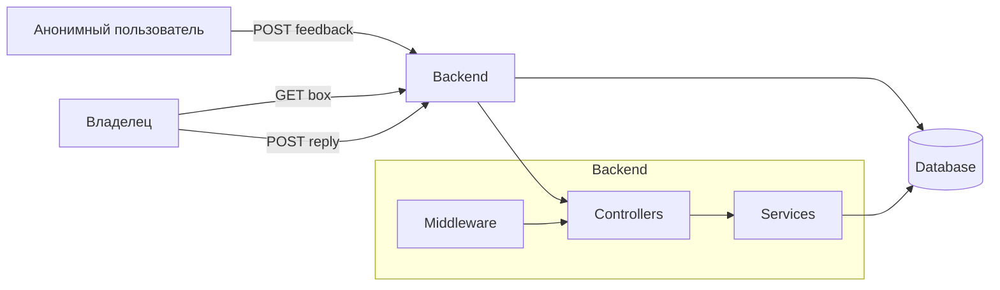

# Information-system-for-collecting-anonymous-verified-reviews

## 🚀Идея

Сервис для получения контролируемой обратной связи. Основной акцент сделан на анонимности отправителя при сохранении прозрачности для получателя.

---
## 👥 Команда

## 🔹Backend — Жабенко Илья

* модели БД
* API
* бизнес-логика

## 🔹Team Lead — Огнев Руслан

* архитектура
* безопасность
* middleware

## 🔹Frontend — Брягиня Александр 

* UI/UX
* работа с API

## 🔹FullStack — Лесовский Егор

---

## 🧩 Архитектура

### 📦 Основные сущности

- **Box** — ящик отзывов  

- **Feedback** — анонимный отзыв  

- **Reply** — ответ владельца  

---

## 🗄️ Структура базы данных!

---

## 🌎API

## Как использовать

- Импортируйте `openapi.yaml` в Swagger Editor, Postman или Insomnia.
- Разработчики backend должны реализовать API согласно спецификации.
- Запустите локально с Docker: `docker compose up --build`.

## Возможности

- Анонимная отправка отзывов
- Доступ только владельцу через токен
- Ответы на отзывы
- Токен можно передавать как параметр запроса `?token=...` или заголовок `X-Owner-Token`
- Базовая валидация и ограничение скорости

## Базовый URL

http://localhost:8000

---

## 📌 Отправить отзыв (аноним)

POST /box/{uuid}/feedback

`
{
  "text": "Ваш отзыв"
}`

## 📌 Получить отзывы (владелец)

GET /box/{uuid}?token=...

## 📌 Ответить на отзыв

POST /feedback/{id}/reply?token=...

---

## 🔐 Безопасность

## ✅ Анонимность

* IP не сохраняется (или хэшируется)
* user-agent — опционально

## ✅ Ограничение скорости

* 5–10 запросов / минута на IP
* применяется к:
    * POST /box/{uuid}/feedback

## ✅ Фильтрация текста

* максимум 500 символов
* blacklist слов
* удаление ссылок (regex)

## ✅ Авторизация

* доступ только при совпадении owner_token
