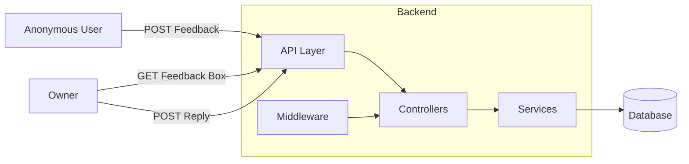

# Anonymous Verified Reviews System
> Система для сбора анонимной и верифицированной обратной связи с контролируемым доступом владельца к отзывам.
## 📖 О проекте
**Anonymous Verified Reviews System** — это сервис для безопасного сбора анонимных отзывов, предложений и обратной связи.
Основная цель проекта — обеспечить баланс между:
- анонимностью отправителя;
- контролируемым доступом владельца к данным;
- прозрачностью взаимодействия;
- защитой от спама и злоупотреблений.
Пользователь может оставить отзыв без регистрации и раскрытия личности, а владелец получает доступ к сообщениям только через специальный токен доступа.
---
## ✨ Основные возможности
### Для пользователей
- Анонимная отправка отзывов
- Простая форма обратной связи
- Отсутствие необходимости регистрации
- Быстрая отправка сообщений
### Для владельцев
- Просмотр всех отзывов через защищённый токен
- Ответы на отзывы
- Управление обратной связью
- Изолированные «ящики отзывов»
### Безопасность
- Ограничение частоты запросов (Rate Limiting)
- Валидация входящих данных
- Фильтрация нежелательного контента
- Токенизированный доступ к данным
- Минимизация хранения пользовательских данных
---
# 🏗 Архитектура

---
# 📦 Основные сущности
## Box
Контейнер для хранения отзывов.
Каждый Box имеет:
- уникальный UUID;
- owner token;
- набор связанных отзывов.
## Feedback
Анонимное сообщение пользователя.
Содержит:
- текст сообщения;
- дату создания;
- связь с Box.
## Reply
Ответ владельца на отзыв.
Позволяет выстраивать обратную коммуникацию без раскрытия личности отправителя.
---
# 🗄 Структура данных
Схема базы данных:
<https://dbdiagram.io/d/69fa66b654a51d93d39c2be2>
Основные связи:
```text
Box
 ├── Feedback
 │     └── Reply
```
---
# 🛠 Технологический стек
## Backend
- Python
- FastAPI
- Pydantic
- Uvicorn
## Frontend
- Node.js
- JavaScript / TypeScript
- Vite
## Infrastructure
- Docker
- Docker Compose
## API
- OpenAPI / Swagger
- ReDoc
---
# 📁 Предполагаемая структура проекта
```text
.
├── backend/
│   ├── src/
│   ├── services/
│   ├── middleware/
│   ├── models/
│   └── main.py
│
├── frontend/
│   ├── src/
│   ├── public/
│   └── package.json
│
├── openapi.yaml
├── docker-compose.yml
├── README.md
└── .env
```
---
# 🚀 Быстрый старт
## Требования
Перед запуском убедитесь, что установлены:
- Docker Desktop
- Docker Compose
- Python 3.11+
- Node.js 18+
---
# 📥 Установка
## 1. Клонирование репозитория
```bash
git clone https://github.com/Kanayeqqe/Information-system-for-collecting-anonymous-verified-reviews.git
cd Information-system-for-collecting-anonymous-verified-reviews
```
## 2. Настройка переменных окружения
Создайте файл:
```bash
.env
```
Пример содержимого:
```env
TELEGRAM_BOT_TOKEN=your_token
API_BASE_URL=http://localhost:8000
```
---
# 🐳 Запуск через Docker (рекомендуется)
```bash
docker compose up --build
```
---
# 💻 Локальный запуск
## Backend
Создание виртуального окружения:
```bash
python -m venv .venv
```
### Windows
```bash
.venv\Scripts\activate
```
### Linux / macOS
```bash
source .venv/bin/activate
```
Установка зависимостей:
```bash
pip install --upgrade pip
pip install -r requirements.txt
```
Запуск:
```bash
uvicorn src.main:app \
    --reload \
    --host 0.0.0.0 \
    --port 8000
```
---
## Frontend
Установка зависимостей:
```bash
cd frontend
npm install
```
Запуск:
```bash
npm run dev
```
---
# 📚 API Документация
После запуска доступны:
### Swagger UI
```text
http://localhost:8000/docs
```
### ReDoc
```text
http://localhost:8000/redoc
```
---
# 🔌 OpenAPI
Проект использует OpenAPI-спецификацию.
Вы можете импортировать файл:
```text
openapi.yaml
```
в:
- Swagger Editor
- Postman
- Insomnia
для тестирования и генерации клиентов.
---
# 📡 API Endpoints
## Отправить отзыв
```http
POST /box/{uuid}/feedback
```
Body:
```json
{
  "text": "Ваш отзыв"
}
```
---
## Получить отзывы владельца
```http
GET /box/{uuid}?token=OWNER_TOKEN
```
или:
```http
X-Owner-Token: OWNER_TOKEN
```
---
## Ответить на отзыв
```http
POST /feedback/{id}/reply?token=OWNER_TOKEN
```
---
# 🔒 Безопасность
## Анонимность
Проект проектируется таким образом, чтобы минимизировать возможность идентификации автора сообщения.
Подходы:
- отсутствие обязательной регистрации;
- отсутствие хранения персональных данных;
- возможность исключить хранение IP-адресов;
- опциональная анонимизация технических метаданных.
## Rate Limiting
Ограничение запросов:
```text
5–10 запросов в минуту на IP
```
Применяется к:
```http
POST /box/{uuid}/feedback
```
## Валидация данных
Ограничения:
- максимальная длина сообщения — 500 символов;
- фильтрация запрещённых слов;
- удаление ссылок через регулярные выражения;
- проверка структуры запросов.
## Авторизация владельца
Доступ к отзывам разрешён только при наличии корректного:
```text
owner_token
```
Все операции чтения и ответа проходят проверку токена.
---
# 🧪 Тестирование
Backend:
```bash
pytest
```
Frontend:
```bash
npm test
```
---
# 📈 Возможные направления развития
- Telegram-уведомления о новых отзывах
- Email-уведомления
- Модерация сообщений
- Реакции на ответы
- Категории отзывов
- Аналитика и статистика
- Dashboard владельца
- JWT-аутентификация
- Поддержка нескольких владельцев
- Экспорт данных
---
# 🤝 Команда
## Team Lead
**Руслан Огнев**
- архитектура системы
- безопасность
- middleware
## Backend/fullstack
**Илья Жабенко**
- проектирование БД
- API
- бизнес-логика
## Frontend
**Александр Брягиня**
- UI/UX
- интеграция с API
## Frontend - bot
**Егор Лесовский**
- bot-разработка
- интеграция компонентов
---
# 🤝 Contributing
1. Fork репозитория
2. Создайте ветку
```bash
git checkout -b feature/new-feature
```
3. Внесите изменения
4. Создайте Pull Request
---
# 📄 License
Проект распространяется под лицензией, указанной в репозитории.
Если лицензия ещё не добавлена, рекомендуется использовать:
```text
MIT License
```
---
# ⭐ Цель проекта
Создать удобную платформу для получения честной и безопасной обратной связи, где пользователь может свободно выражать мнение, а владелец — получать структурированные отзывы без нарушения приватности отправителей.